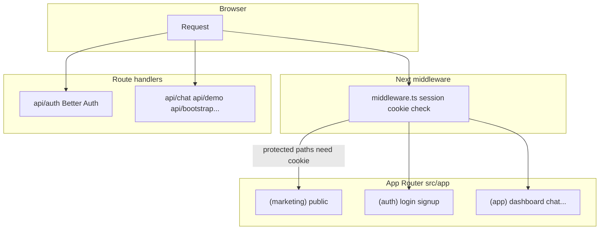

# Templaite architecture

**Agents: read [AGENTS.md](../AGENTS.md) first** for commands, stack list, Prisma/Better Auth workflow, and env templates. This file is a **map** of where things live.

## Request flow (high level)

- **Protected UI** (`/dashboard`, `/chat`, `/playground`, `/account`, `/billing`): [src/middleware.ts](../src/middleware.ts) redirects to `/login` when the Better Auth session cookie is missing.
- **Auth HTTP**: all Better Auth routes go through [src/app/api/auth/[...all]/route.ts](../src/app/api/auth/[...all]/route.ts).

## Canonical files

| Area | File(s) |
|------|---------|
| **Next.js root layout / providers** | [src/app/layout.tsx](../src/app/layout.tsx), [src/components/providers.tsx](../src/components/providers.tsx) |
| **Global styles / tokens** | [src/app/globals.css](../src/app/globals.css), [components.json](../components.json) |
| **Middleware** | [src/middleware.ts](../src/middleware.ts) |
| **Database** | [src/lib/prisma.ts](../src/lib/prisma.ts), [prisma/schema.prisma](../prisma/schema.prisma), [prisma.config.ts](../prisma.config.ts) |
| **Auth (server)** | [src/lib/auth.ts](../src/lib/auth.ts) |
| **Auth (client)** | [src/lib/auth-client.ts](../src/lib/auth-client.ts) |
| **AI chat config** | [src/lib/ai-chat-config.ts](../src/lib/ai-chat-config.ts) |
| **AI HTTP** | [src/app/api/chat/route.ts](../src/app/api/chat/route.ts) |
| **Bootstrap flags** | [src/lib/bootstrap-status.ts](../src/lib/bootstrap-status.ts), [src/app/api/bootstrap/status/route.ts](../src/app/api/bootstrap/status/route.ts) |
| **Notion blog** | [src/lib/notion/](../src/lib/notion/), [docs/BLOG_NOTION.md](./BLOG_NOTION.md) |

## AI assistant layout (repo)

| Resource | Path |
|----------|------|
| **Cursor rules** | [.cursor/rules/](../.cursor/rules/) |
| **Cursor / project skills** | [.cursor/skills/](../.cursor/skills/) |
| **Claude index** | [CLAUDE.md](../CLAUDE.md) |

## Route groups (App Router)

| Group | Role |
|-------|------|
| `(marketing)` | Public marketing pages |
| `(auth)` | Login, signup, password flows |
| `(app)` | Signed-in experience; most new product pages go here unless public |

When adding a **new signed-in page**, if it should require authentication at the edge, update **both** `protectedPrefixes` and `config.matcher` in [middleware.ts](../src/middleware.ts).
